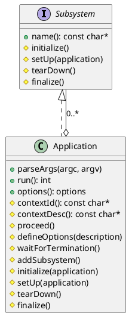
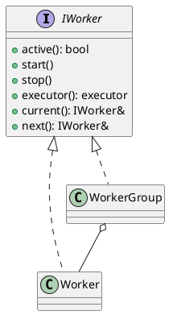

# Introduction

The common classes are intended to be as building blocks for any service and helpful to handle service lifetime.

# Purpose

The main purpose is providing useful classes to compose any service and provide tools to handle service lifetime.

# Component Structure

## Software Units

| Name              | Description                                                 |
|-------------------|-------------------------------------------------------------|
| Application       | Represents the base class of service                        |
| Subsystem         | Represents the base class of subsystem within service       |
| AsyncResult       | Represents any asynchronous result                          |
| HttpRequest       | Represents HTTP request                                     |
| LoggerInitializer | The logger initializer to initialize logging within service |
| SecureContext     | The SSL secure context                                      |
| Worker            | The worker to handle multiple worker threads                |
| WorkerGroup       | The worker group to handle multiple workers                 |

## Class Diagrams

* Application service base class

* Worker and worker group classes

